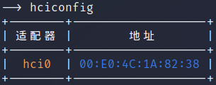
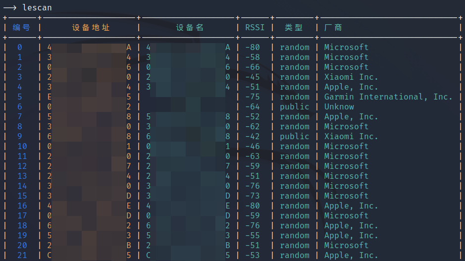
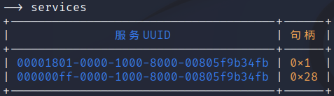
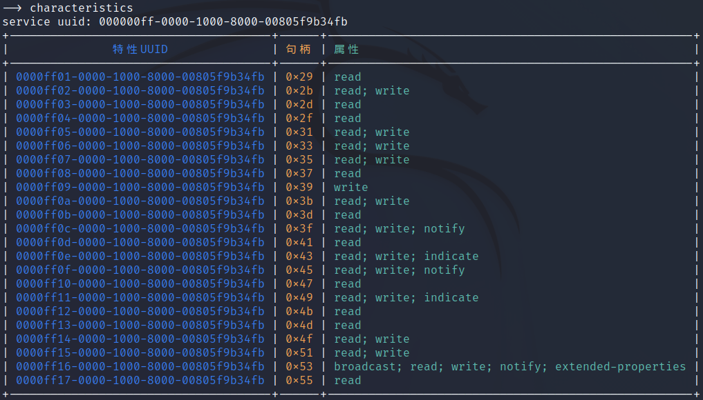
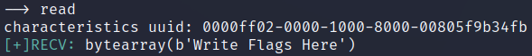
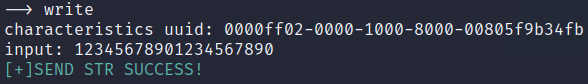
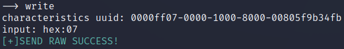
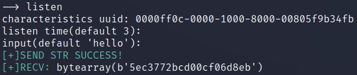
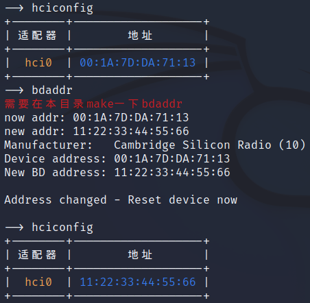

# BLE-Security-Tool

   

写个小工具，我也不知道能写到什么程度Orz。

[可能因为bluez实现的某些问题](https://github.com/bluez/bluez/issues/219)，连接之后断开连接会报错。这时候可以重启一下蓝牙服务`service bluetooth restart`，然后拔插一下蓝牙适配器，这个问题完美的影响了工具运行的稳定性

也可能不是bluez的问题，之前用十几块钱的蓝牙适配器每次都会出现这个问题，现在换了个八十多的适配器没有遇到过这个问题了23333

# 目前实现的功能

- 查看本机的适配器：hciconfig

- 扫描周围低功耗蓝牙设备：lescan

- 连接到低功耗蓝牙设备：connect

- 扫描连接设备的服务：services

- 获取连接设备某服务的特征：characteristics

- 读取某特征的值

- 向某特征写入值（字符串）

- 向某特征写入值（十六进制）

- 方向键上下选择之前输入的命令

借助readline这个库，可以使用方向键的↑和↓来选择之前输过的命令

- 监听特征的通知和指示

- 调用bdaddr进行适配器地址的修改（重新拔插适配器生效）

